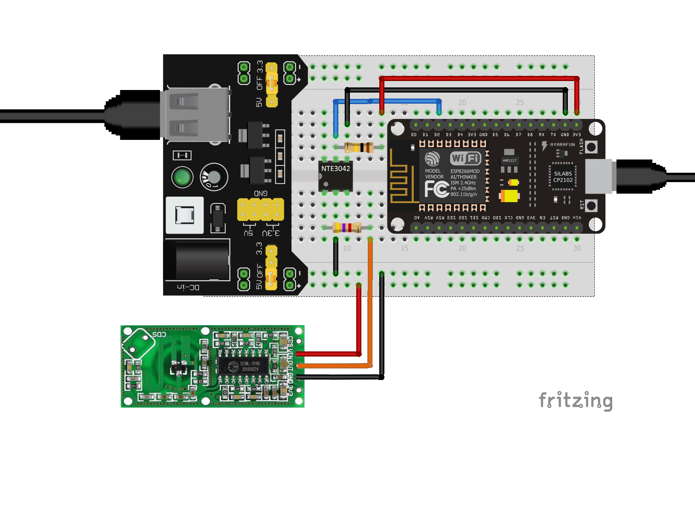
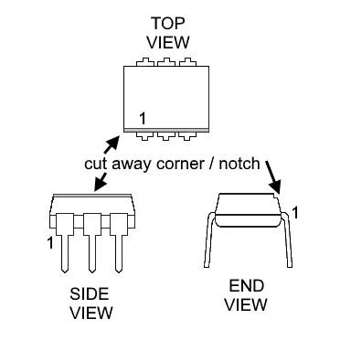

# ESP8266-RCWL0516

This is an ESP8266 project that uses a RCWL0516 microwave presence sensor. The code is capable of detecting the state of the sensor by utilizing either polling or interrupts. The circuit also utilizes *opto-coupling* to isolate the sensor from the ESP8266.

# History

The RCWL-0516 is a sensor that I wanted to try out. I intend to use it in applications where I wanted to sense the presence of a person or an animal (like my dog!) and trigger an event or action. I initially investigated the use of a PIR, but they are incapable of sensing through barriers such as glass or a wooden door.

In addition to the use of the RCWL-0516 I also wanted to experiment with opto-coupling the sensor output to the ESP8266 GPIO.

I also wanted to investigate polling vs interrupts on the ESP8266. The sketch in this repository is capable of using either method for detecting changes on an input.

# Running the Application

The code is not dependent on the type of the sensor. It could be used with any sensor or switch that is capable of producing a logic `1` or `0` on an input of the ESP8266. The only modifications the *might* be necessary are - 

* Modifying the input pin, the currently used pin is set with `#define SENSOR_PIN D2` in the sketch file.
* Modifying the polarity of whether the input is "active" or "idle". The circuit (*as described below*) and code assumes that the sensor is "active" when the input is "low".

Use the Arduino IDE to build and download the sketch to the ESP8266. If the circuit (*described below*) is used the expected output in the console is - 

```
interr - ACTIVE
interr - IDLE
```

When `interr - ACTIVE` is seen the on-board LED will be lit. And when `interr - IDLE` is seen the LED will be off. And `ACTIVE` will indicate that something has triggered the sensor.

## The Circuit

Parts Used :

* RCWL-0516 microwave presence sensor
* ESP8266 NodeMCU v1.0
* NTE3042 Opto-coupler (*or equivalent*)
* 100k resistor
* 4.7k resistor
* 5v power supply to power the sensor and input of the opto-coupler
* 5v supply to power the ESP8266 and the output of the opto-coupler
* Solderless bread board

Miscellaneous/Option Parts :

* 5 pin solder-in header, I used a right-angle pin header.
* Male/Female jumper wires
* Housing/case for the RCWL-0516. I used an old CF memory card case that I modified slightly to contain the board.
* Mini clamps, used for holding the CF card case and standing it up vertically.

*Component sources will be listed near the end of this document.*

### Schematic

<p align="center">
  
</p>

### Finished Breadboard

<p align="center">
  
</p>

**NOTES :** The NTE3042 chips I used didn't have the typical pin 1 markings. Most IC's will have a small dimple or a printed dot on the top corner that marks pin 1. However the NTE3042 chips have the left edge (*looking down*) corner removed. And unfortunately the resulting notch is very small and difficult to see without magnification. Here's a diagram that might provide a better description :

<p align="center">
  
</p>

### RCWL0516 Details

The RCWL-0516 sensors are relatively inexpensive. I found them at 5 for about $10 ($2 each). When they arrived they needed to be "snapped apart". It's typical for smaller electronic boards to be manufactured this way. It makes them easier to assemble. There may also be a small piece to snap off where the connection holes are.

**IMAGE OF BOARDS TOGETHER**

So you may have to separate them. It's not difficult but I recommend being careful. It's easiest if you have a sturdy hold on two adjacent boards and then gently bend at the edge where they're attached to each other.

For my purposes I decided that I wanted a 5 pin *right angle* pin header on the board. In my opinion it's a better option compared to soldering wires directly to the board.

**IMAGE OF BOARD WITH AND WITHOUT HEADER**

My next step was to find a way where I could either mount the board onto something or enclose it in some type of container. So after rummaging through my bits and pieces I found an old CF memory card case. And as it turns out it needed only minor modifications and the board with the connector fit it perfectly.

**IMAGE OF CASE, DETAILS OF MOD, AND WITH BOARD INSIDE**

### Testing the Circuit

Although I've had luck with the 5 sensors I bought I've read reviews where other have had problems. For example, I read a few reviews stated that the board output would be at 5v when the sensor was activated. However it's supposed to be 3.3v. And that was enough reason for me to use the opto-coupler and test the circuit before connecting it to my NodeMCU.

Testing was simple and only required the use of a voltmeter. First I tested the RCWL-0516 independantly and verified that it's output pin produced either 3.3v (*approximately*) or it would be a `gnd`. Then I assembled the opto-couple portion of the circuit with the sensor attached. Trial and error and some guessing helped me determine that I needed a 100k pull-up resistor on the connection between the NTE3042 (*opto-coupler*) and the NodeMCU.

**INSERT TRUTH TABLE, SENSOR->OPTO**


## Download & Run

Assuming that you've assembled and tested the circuit it's time to try out the code! After the sketch has been compiled and downloaded the on-board LED of the NodeMCU *might* be lit when the program starts. If so just wait about 5 to 10 seconds and it should turn off. When it turns off the sensor has not detected any presence.

Please keep in mind that the sensor is quite sensitive. And a minor amount of movement within its range will activate it. 

When the LED is off try waving your hand in front of the sensor (*the side with the components*) and the LED should light up and you should see `interr - ACTIVE` on the IDE console. Wait about 5 to 10 seconds and the LED should turn off and `interr - IDLE` will be seen on the console.


# Code Details

## Polling for State Change

## Interrupt on State Change

### The Need for Debouncing


# Component Sources

## Component Data Sheets


# Build Details


# Recommended Reading
