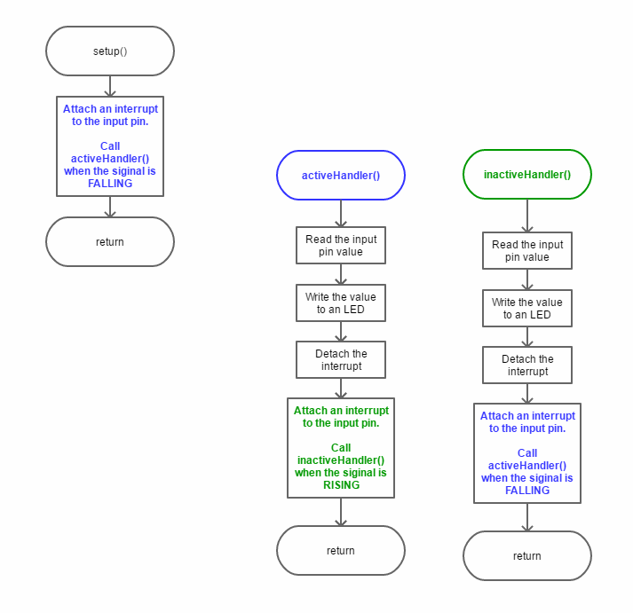
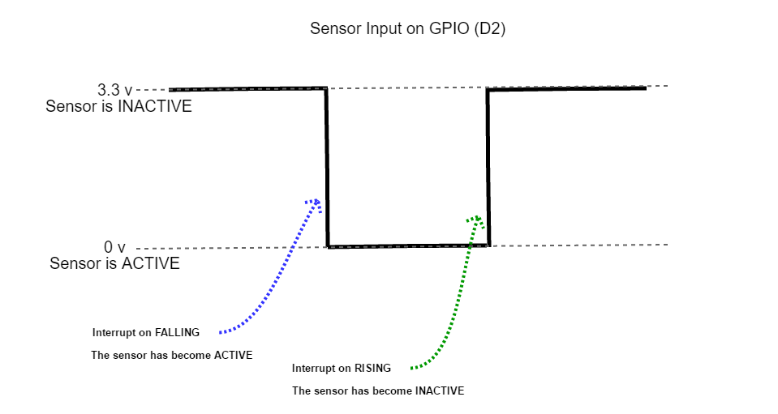

# ESP8266-RCWL0516

* [Overview](#overview)
* [History](#history)
* [Running the Application](#running-the-application)
* [Code Details](#code-details)
    * [Polling for State Change](#polling-for-state-change)
    * [Interrupt on State Change](#interrupt-on-state-change)
        * [RISING and FALLING](#rising-and-falling)
        * [CHANGE](#change)
            * [The Need for Debouncing](#the-need-for-debouncing)
* [Build Details](#build-details)
    * [The Circuit](#the-circuit)
        * [Schematic](#schematic)
    * [Assembling the Parts](#assembling-the-parts)
        * [RCWL0516 Details](#rcwl0516-details)
        * [Testing the Circuit](#testing-the-circuit)
        * [Finished Breadboard](#finished-breadboard)
    * [Download and Run](#download-and-run)
* [Component Sources](#component-sources)
* [Future Modifications](#future-modifications)
    * [ESP-01S](#esp-01s)
    * [Isolated Power Supply](#isolated-power-supply)
    * [UDP](#udp)
* [Links and References](#links-and-references)
    * [NodeMCU](#nodemcu)
    * [Interrupts](#interrupts)
    * [RCWL-0516](#rcwl-0516)

# Overview

This is an ESP8266 project that uses a RCWL-0516 microwave presence sensor. The code is capable of detecting the state of the sensor by utilizing either polling or interrupts. The circuit also utilizes *opto-coupling* to isolate the sensor from the ESP8266.

If you need to know more about the RCWL-0516 before proceeding there are some helpful links at the end of this file.

# History

The RCWL-0516 is a sensor that I wanted to try out. I intend to use it in applications where I wanted to sense the presence of a person or an animal (like my dog!) and trigger an event or action. I initially investigated the use of a PIR, but they are incapable of sensing through barriers such as glass or a wooden door.

In addition to the use of the RCWL-0516 I also wanted to experiment with opto-coupling the sensor output to the ESP8266 GPIO.

I also wanted to investigate polling vs interrupts on the ESP8266. The sketch in this repository is capable of using either method for detecting changes on an input.

# Running the Application

The code is not dependent on the type of the sensor. It could be used with any sensor or switch that is capable of producing a logic `1` or `0` on an input of the ESP8266. The only modifications the *might* be necessary are - 

* Modifying the input pin, the currently used pin is set with `#define SENSOR_PIN D2` in the sketch file.
* Modifying the polarity of whether the input is "active" or "idle". The circuit (*as described below*) and code assumes that the sensor is "active" when the input is "low".

Use the Arduino IDE to build and download the sketch to the ESP8266. If the circuit (*described below*) is used the expected output in the console is - 

```
interr - ACTIVE
interr - IDLE
```

When `interr - ACTIVE` is seen the on-board LED will be lit. And when `interr - IDLE` is seen the LED will be off. And `ACTIVE` will indicate that something has triggered the sensor.

# Code Details

There are two methods of state-change detection in this sketch :

* Polled - The input pin is read in the loop() function and if the current input state doesn't match the last changed state then announce the change and save the state.
* Interrupt - There are two methods used here for invoking an input interrupt when the input state changes :
    * Interrupt on a Level, toggle between levels on subsequent level changes.
    * Interrupt on Change

It possible to choose the method for state detection. This is done using `#define` and `#ifdef`. For example, the sketch as found in the repository will use interrupts - 

```
//#define POLLED
//  - OR -
#define INTERR
// this will enable interrupt on change instead of 
// interrupt on level (low vs high)
//#define INTERR_CHG
```

If polling is desired then uncomment the `#define POLLED` and comment out the `#define INTERR`. For example - 

```
#define POLLED
//  - OR -
//#define INTERR
// this will enable interrupt on change instead of 
// interrupt on level (low vs high)
//#define INTERR_CHG
```

## Polling for State Change

Polling is the simplest approach to reading the sensor. However extra consideration should be taken because the polling becomes part of the main execution loop. And it might impact other tasks occurring within the main execution loop. Here is a simple code example - 

```c
#define SENSOR_PIN D2

bool state;
bool lastState;

void setup()
{
    // initialize the states...
    state = false;
    lastState = false;
    
    // Initialize the IO
    setUpIO();
}

void loop()
{
    // read the state of the sensor and see if it 
    // matches the last known state
    if((state = digitalRead(SENSOR_PIN)) != lastState)
    {
        // no match, change the state of the LED
        digitalWrite(LED_BUILTIN, state);

        // remember this state as the last
        lastState = state;

        // sensor indicates active when it pulls
        // the input to 0.
        Serial.println("polled - " + String(state ? "IDLE" : "ACTIVE"));
    }
    yield();
    delay(500);
}

/*
    Set up the GPIO pins as needed...
*/
void setUpIO()
{
    // set up the built-in LED for use...
    pinMode(LED_BUILTIN, OUTPUT);
    // turn off the on-board LED
    digitalWrite(LED_BUILTIN, LED_BUILTIN_OFF);

    // set up the pin to read the sensor state
    // NOTE: An external pull-up resistor was used in
    // the circuit where this sketch was developed.
    pinMode(SENSOR_PIN, INPUT);
}
```

In the example above the sensor input is read (*polled*) every 500ms. When the current state doesn't match the the last transitioned state then the sensor has changed its output.

Some disadvantages to polling are - 

* The *delay* between `loop()` calls must be short enough to insure that changes won't be missed.
* Code complexity will increase as functionality is added.

## Interrupt on State Change

If you're not already familiar with the concept of *interrupts* then check out some [Interrupts](#interrupts) links at the end of this file.

In regards to monitoring the state of a digital input the use of a properly configured interrupt is generally a better choice than polling. But not in all situations. And remember then while in an *interrupt service routine* don't spend a lot of time or CPU cycles in that code.

I tried a couple of interrupt types, `FALLING`/`RISING` and `CHANGE`. And had some interesting results.

### RISING and FALLING

The GPIO input (`D2`) and the interrupts work like this :

First the code, notice how the interrupt handler is swapped when a handler is called - 

<p align="center">
  
</p>
<br>

Here's a simple timing diagram - 

<p align="center">
  
</p>
<br>

The *swapping* of the interrupt handlers is done because the ESP8266 does not allow for attaching more than one interrupt to a pin at a time.

Here is a simple code example -

```c
#define SENSOR_PIN D2

void setup()
{
    // Initialize the IO
    setUpIO();
    
    // attach an interrupt handler to run when the input is going low
    attachInterrupt(digitalPinToInterrupt(SENSOR_PIN), sensorHandlerActive, FALLING);
}

/*
    Set up the GPIO pins as needed...
*/
void setUpIO()
{
    // set up the built-in LED for use...
    pinMode(LED_BUILTIN, OUTPUT);
    // turn off the on-board LED
    digitalWrite(LED_BUILTIN, LED_BUILTIN_OFF);

    // set up the pin to read the sensor state
    // NOTE: An external pull-up resistor was used in
    // the circuit where this sketch was developed.
    pinMode(SENSOR_PIN, INPUT);
}

/*
    The ESP8266 only allows one handler per pin. That is why each handler
    attaches the opposite handler before returning.
*/
void sensorHandlerActive()
{
    // indicate the new sensor state - active
    setLED(LED_BUILTIN_ON);
    // attach an interrupt handler to run when the input is going high
    detachInterrupt(digitalPinToInterrupt(SENSOR_PIN));
    attachInterrupt(digitalPinToInterrupt(SENSOR_PIN), sensorHandlerIdle, RISING);
}

void sensorHandlerIdle()
{
    // indicate the new sensor state - idle
    setLED(LED_BUILTIN_OFF);
    // attach an interrupt handler to run when the input is going low
    detachInterrupt(digitalPinToInterrupt(SENSOR_PIN));
    attachInterrupt(digitalPinToInterrupt(SENSOR_PIN), sensorHandlerActive, FALLING);
}

void loop()
{
}
```

### CHANGE

The other type of interrupt I tried was `CHANGE`. It's supposed to interrupt when the *input changes*. It can be from HIGH to LOW or LOW to HIGH.

To enable this inerrupt type - 

`//#define POLLED`**<br>
`//  - OR -`<br>
**`#define INTERR`**<br>
`// this will enable interrupt on change instead of `<br>
`// interrupt on level (low vs high)`<br>
**`#define INTERR_CHG`**

Here's an example of the code - 

```c
#define SENSOR_PIN D2

void setup()
{
    // Initialize the IO
    setUpIO();
    
    // attach an interrupt handler to run when the input changes
    attachInterrupt(digitalPinToInterrupt(SENSOR_PIN), sensorHandler, CHANGE);
}

/*
    Set up the GPIO pins as needed...
*/
void setUpIO()
{
    // set up the built-in LED for use...
    pinMode(LED_BUILTIN, OUTPUT);
    // turn off the on-board LED
    digitalWrite(LED_BUILTIN, LED_BUILTIN_OFF);

    // set up the pin to read the sensor state
    // NOTE: An external pull-up resistor was used in
    // the circuit where this sketch was developed.
    pinMode(SENSOR_PIN, INPUT);
}

/*
    A single interrupt handler for "change" on the input pin.
*/
void sensorHandler()
{
    bool state = digitalRead(SENSOR_PIN);
    // indicate the new sensor state - active
    setLED(state);
}
```

#### The Need for Debouncing

I had some unexpected results with this interrupt type. It appears that there is some *bouncing* when the sensor becomes active. What's strange about that is that I would expect to see the input bouncing between active and inactive, not multiple `ACTIVE`.

```
interr - ACTIVE
interr - ACTIVE
interr - IDLE
interr - ACTIVE
interr - ACTIVE
interr - IDLE
interr - ACTIVE
interr - ACTIVE
interr - ACTIVE
interr - IDLE
interr - ACTIVE
interr - ACTIVE
interr - ACTIVE
interr - IDLE
```

I'll have to investigate this a bit further. Unfortunately I don't have an oscilloscope to view the input signal.

# Build Details

## The Circuit

Parts Used :

* RCWL-0516 microwave presence sensor
* ESP8266 NodeMCU v1.0
* NTE3042 Opto-coupler (*or equivalent*)
* 100k resistor
* 4.7k resistor
* Two individual power sources - 
    * 5v power supply to power the sensor
    * 5v supply to power the ESP8266, I used the board's USB connection.
* A solderless bread board
* Bread board jumper wires
* Lead-free solder

Miscellaneous/Optional Parts :

* 5 pin solder-in header, I used a right-angle 5 pin header.
* Male/Female jumper wires, for connecting the sensor to the rest of the circuit.
* Housing/case for the RCWL-0516. I used an old CF memory card case that I modified slightly to contain the board.
* Mini clamps, used for holding the CF card case and standing it up vertically.

Tools Used :

* Small needle-nose pliers
* Small wire cutter
* Razor knife
* Voltmeter
* Soldering iron

*Component sources will be listed near the end of this document.*

### Schematic

Here's a basic schematic of the circuit - 

<p align="center">
  
</p>

The output of the opto-coupler is wired as *open collector*, which explains the need for a pull-up resistor to bring the voltage up when the sensor is inactive (*idle*). The use of the inverted logic has an advantage, the input value on `D2` can be used directly to turn the LED on or off. 

| Sensor Output | Opto Output | Active State Value | LED |
|:-------------:|:-----------:|:------------------:|:---:|
|      3.3v     |     GND     |          0         |  ON |
|      GND      |     OPEN    |          1         | OFF |

## Assembling the Parts

It's assumed that you (*the reader*) most likely are already familiar with *bread boarding* stuff. But it's possible you've not used something like the RCWL-0516 or other small circuit boards. So I'll skip the "*how to bread board*" stuff and go directly to the RCWL-0516. 

### RCWL0516 Details

The RCWL-0516 sensors are relatively inexpensive. I found them online at 5 for about $10 ($2 each). When they arrived they needed to be "snapped apart". It's typical for smaller electronic boards to be manufactured this way. It makes them easier to assemble. There may also be a small piece to snap off where the connection holes are.

<p align="center">
  
</p>

So you may have to separate them. It's not difficult but I recommend being careful. It's easiest if you have a sturdy hold on two adjacent boards and then gently bend at the edge where they're attached to each other.

For my purposes I decided that I wanted a 5 pin *right angle* pin header on the board. In my opinion it's a better option compared to soldering wires directly to the board.

If you are using a *male* header on the sensor it's likely you'll have to cut the length you need from a larger header. Use the small wire cutter and place the cutting edge in the small groove between the pins. Be careful when cutting the header! The smaller piece has a tendency to fly off somewhere!

<p align="center">
  
</p>

<p align="center">
  
</p>

My next step was to find a way where I could either mount the board onto something or enclose it in some type of container. So after rummaging through my bits and pieces I found an old CF memory card case. And as it turns out it needed only minor modifications and the board with the connector fit it perfectly.

<p align="center">
  
</p>

Now that I had the sensor in a case I needed a way to stand it up or attach it to something. For attaching it to a window or a door *painter's tape* works very well. For standing it upright on a table I used some plastic mini-clamps that I found a local tool supply store.

<p align="center">
  
</p>

### Testing the Circuit

Although I've had luck with the 5 sensors I bought I've read reviews where other have had problems. For example, I read a few reviews stated that the board output would be at 5v when the sensor was activated. However it's supposed to be 3.3v! And that was enough reason for me to use the opto-coupler and test the circuit before connecting it to my NodeMCU.

Testing was simple and only required the use of a voltmeter and a 5 volt DC power supply. First I tested the RCWL-0516 independantly and verified that it's output pin produced either 3.3v (*approximately*) or it would be at `gnd`. Then I assembled the opto-couple portion of the circuit with the sensor attached. Trial and error and some guessing helped me determine that I needed a 100k pull-up resistor to 3.3v on the connection between the NTE3042 (*opto-coupler*) and the NodeMCU.

### Finished Breadboard

<p align="center">
  
</p>

**NOTES :** The NTE3042 chips I used didn't have the typical pin 1 markings. Most IC's will have a small dimple or a printed dot on the top corner that marks pin 1. However the NTE3042 chips have the left edge (*looking down*) corner removed. And unfortunately the resulting notch is very small and difficult to see without magnification. Here's a diagram that might provide a better description :

<p align="center">
  
</p>

So you might be wondering "*why the NTE3042?*". Well I happened to be in a local electronics store and it was the *only* opto-coupler they had in stock. And I didn't want to wait for an online order to be delivered, and at about $2 each I figured "why not?". And I was lucky that day, the part worked perfectly for this project.

I recommend that you use at least 12 to 18 inches of wire to connect the sensor to the bread board. And keep it separated from the NodeMCU. I've read that the radio frequency used by the sensor (*in the gigahertz range*) conflicts with the 2.4Ghz signal used by the WiFi on the NodeMCU board.

## Download and Run

Assuming that you've assembled and tested the circuit it's time to try out the code! After the sketch has been compiled and downloaded the on-board LED of the NodeMCU *might* be lit when the program starts. If so just wait about 2 to 3 seconds and it should turn off. When it turns off the sensor has not detected any presence.

Please keep in mind that the sensor is quite sensitive. And a minor amount of movement within its range will activate it. 

When the LED is off try waving your hand in front of the sensor (*the side with the components*) and the LED should light up and you should see `interr - ACTIVE` on the IDE console. Wait about 2 to 3 seconds and the LED should turn off and `interr - IDLE` will be seen on the console.

# Component Sources

Except for the NTE3042 I found all of the parts on-line. They're easy to find and not very expensive. The NTE3042 was bought at a local electronics retailer. However if you can't find one try using a 4N35 opto-coupler.

# Future Modifications

## ESP-01S

The NodeMCU is overkill for this project. But I had some laying around so that why it's used here. I'm planning on giving an ESP-01S a try.

## Isolated Power Supply

I've been investigating the use of an *isolating power supply* with the circuit. Its purpose would be to provide the sensor and the input side of the opto-coupler with an isolated 5 volt supply. And the 5 volt input would also power the NodeMCU/ESP-01S.

Here a couple of links to the isolated power supply I've chosen -

* [DCH010505S Miniature, 1W, 3kVDC Isolated DCDC Converters](http://www.ti.com/product/dch010505s?qgpn=dch010505s)
* [DCH010505SN7 Texas Instruments Power Supplies - Board Mount DigiKey](https://www.digikey.com/products/en?keywords=DCH010505S)

**NOTE :** The NodeMCU board I'm using (*Amica*) can **only** be powered via the USB connector. The pin marked `Vin`  on the board is only an output (*according to the NodeMCU schematic*). There's a limiting diode in the circuit that blocks an input voltage on the pin from getting to the CP2102 which is responsible for creating the 3.3v needed by the ESP8266.

### UDP

I plan on using UDP and have the sensor interrupts drive a UDP connection and packet transmission to a server. The server is likely to be on the same network and implemented in a *Tessel 2*.

# Links and References

## NodeMCU

* [NodeMCU Dev Kit](https://github.com/nodemcu/nodemcu-devkit-v1.0)
* [NodeMCU Documentation](https://nodemcu.readthedocs.io/en/master/)

## Interrupts

* [Arduino - AttachInterrupt](https://www.arduino.cc/reference/en/language/functions/external-interrupts/attachinterrupt/)
* [Gammon Forum Electronics Microprocessors Interrupts](http://gammon.com.au/interrupts)
* [ESP8266 External interrupts techtutorialsx](https://techtutorialsx.com/2016/12/11/esp8266-external-interrupts/)

## RCWL-0516

* [Wiring the RCWL0516 Auto Induction Doppler Microwave Radar with ESP826632Arduino](http://www.14core.com/wiring-the-rcwl0516-auto-induction-doppler-microwave-radar-with-esp826632arduino/)
* [RCWL-0516 information](https://github.com/jdesbonnet/RCWL-0516)


